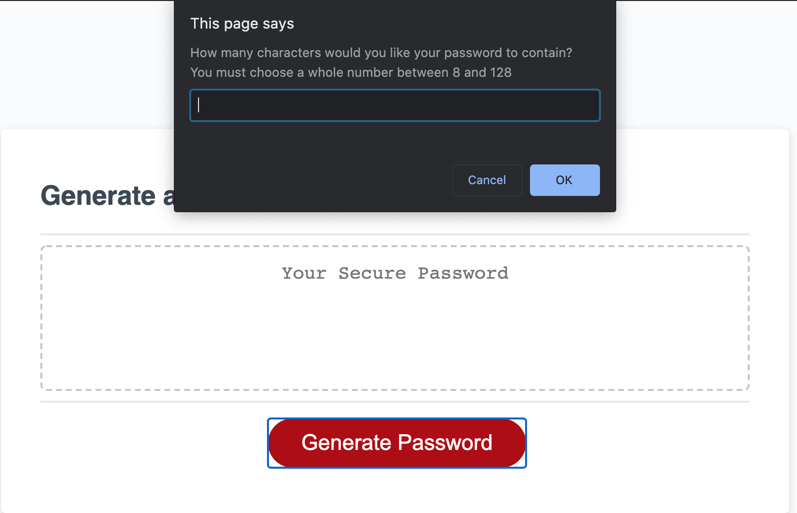
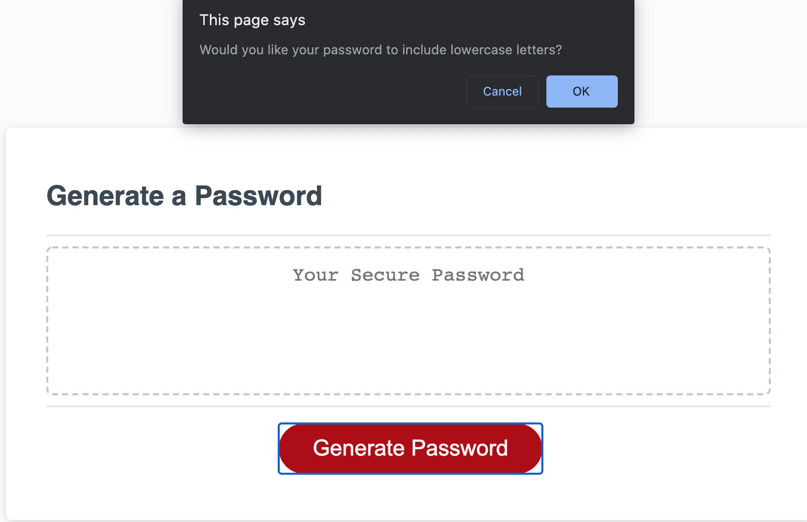

# HW-Password-Generator

## Description 

This project is a program that generates a completely random password based on a few selections that the user makes. This password will be between 8 and 128 characters, and it will contain any combination of the follow character types: lowercase letters, uppercase letters, numbers, and all special characters.

## Table of Contents

* [Usage](#usage)
* [Credits](#credits)
* [License](#license)

## Usage 

In order to access this application, the user can click on the link below to the home page of the website. From there they can use the navbar at the top to navigate the website.

* [Password Generator](https://patrickhannan.github.io/HW-Password-Generator/)

From there, the user should click the generate button. They will be prompted to give the number of charactes they want in their password, which must be at least 8 and no more then 128. If it is outside of that range, the user will receive an error alert and will have to reenter a new number inside of that range. 

Next, the user will receive a series of 4 confirmation alerts asking the user to confirm whether they want a certain type of character. For example, the user will be prompted "Would you like your password to include lowercase letters?" and the user can either confirm that the password will contain this type, or they can cancel the usage of this type in the password generator. 

## Credits

* [Exclamation Marks in Javascript](https://medium.com/better-programming/javascript-bang-bang-i-shot-you-down-use-of-double-bangs-in-javascript-7c9d94446054#:~:text=In%20Javascript%2C%20the%20exclamation%20mark,true%3B%20%2F%2F%20Returns%20false.)
* [Concat Command in Javascript](https://developer.mozilla.org/en-US/docs/Web/JavaScript/Reference/Global_Objects/Array/concat)

## License

MIT License

Copyright (c) 2020 Patrick Hannan

Permission is hereby granted, free of charge, to any person obtaining a copy of this software and associated documentation files (the "Software"), to deal in the Software without restriction, including without limitation the rights to use, copy, modify, merge, publish, distribute, sublicense, and/or sell copies of the Software, and to permit persons to whom the Software is furnished to do so, subject to the following conditions:

The above copyright notice and this permission notice shall be included in all copies or substantial portions of the Software.

THE SOFTWARE IS PROVIDED "AS IS", WITHOUT WARRANTY OF ANY KIND, EXPRESS OR IMPLIED, INCLUDING BUT NOT LIMITED TO THE WARRANTIES OF MERCHANTABILITY, FITNESS FOR A PARTICULAR PURPOSE AND NONINFRINGEMENT. IN NO EVENT SHALL THE AUTHORS OR COPYRIGHT HOLDERS BE LIABLE FOR ANY CLAIM, DAMAGES OR OTHER LIABILITY, WHETHER IN AN ACTION OF CONTRACT, TORT OR OTHERWISE, ARISING FROM, OUT OF OR IN CONNECTION WITH THE SOFTWARE OR THE USE OR OTHER DEALINGS IN THE SOFTWARE.